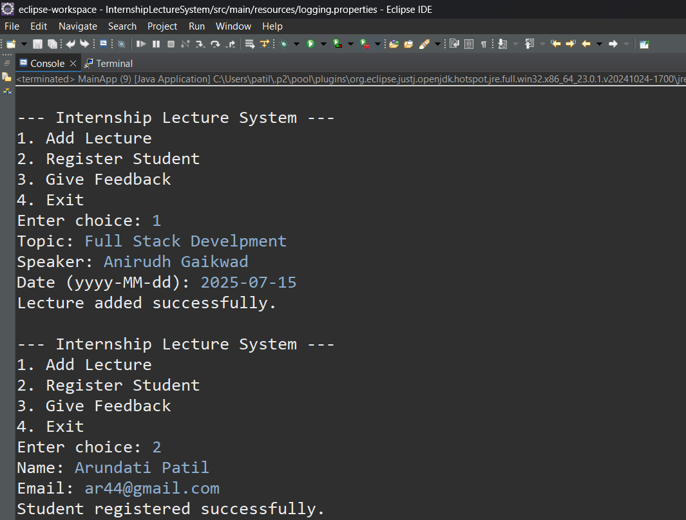

## * Internship Lecture & Feedback Managment System *

The **Internship Lecture & Feedback Managment System** is a console-based Java application built using Maven
**JPA**, **Hibernate 7.x**, and **PostgreSQL**. It allows colleges or institutions to keep track of internship lectures attended by students,
storing information like student details, lecture topics, dates.

---

##  Features

-  Add student details
-  Add internship lectures
-  Add also Feedback
-  View all lectures and participants
-  Simple menu-driven interface via the Java console

---

##  Technologies Used

-  **Java (JDK 17+)**
-  **JPA (Jakarta Persistence API 3.2)**
-  **Hibernate ORM 7.0.1.Final**
-  **PostgreSQL 15+**
-  **Maven (for dependency management)**
-  **Eclipse IDE / IntelliJ / VS Code**

---

##  Project Structure

  InternshipLectureSystem/

├── .gitignore

├── pom.xml

├── README.md

├── src/

│   └── main/

│       ├── java/

│       │   └── com/

│       │       └── example/

│       │           └── internship/

│       │               ├── MainApp.java

│       │               ├── dao/

│       │               │   ├── LectureDAO.java

│       │               │   ├── StudentDAO.java

│       │               │   └── FeedbackDAO.java

│       │               └── entity/

│       │                   ├── Lecture.java

│       │                   ├── Student.java

│       │                   └── Feedback.java

│       └── resources/

│           └── META-INF/

│               └── persistence.xml

└── target/ (auto-generated)


---


---

##  Prerequisites

-  Java 17 or higher  
-  PostgreSQL 15+  
-  pgAdmin (for database management)  
-  Maven  
-  Eclipse / IntelliJ / VS Code IDE

---

##  Database Setup

Create the necessary tables in PostgreSQL:

```sql
CREATE TABLE feedback (
    id SERIAL PRIMARY KEY,
    comments TEXT,
    rating INTEGER CHECK (rating BETWEEN 1 AND 5),
    student_id INT REFERENCES students(id) ON DELETE RESTRICT,
    lecture_id INT REFERENCES lectures(id) ON DELETE RESTRICT
);


CREATE TABLE students (
    id SERIAL PRIMARY KEY,
    name VARCHAR(100) NOT NULL,
    email VARCHAR(100) UNIQUE NOT NULL
);

CREATE TABLE lectures (
    id SERIAL PRIMARY KEY,
    topic VARCHAR(100) NOT NULL,
    speaker VARCHAR(100) NOT NULL,
    date DATE NOT NULL
);

```
---

## Output Image

  


---
   
Contact

 Name: Arundhati Anand Patil

 Email: patilarundhati44@gmail.com

 GitHub: @patilarundhati44


